# Microsoft Purview Data Protection Lab

**Scoped Sensitivity Labels, Custom Sensitive Information Types, Tiered DLP and Retention in a Shared Microsoft 365 Tenant**

I designed, automated and validated a Microsoft Purview data protection pilot for a fictional organisation, **KRU**, inside a shared Microsoft 365 development tenant. I scoped every policy so that it could not affect any other user, mailbox, OneDrive or site in that tenant. I then proved that scope with negative tests and a read-only PowerShell verification script.

> **Lab flow:** Readiness → Scope Boundary → Classify → Detect → Simulate → Enforce → Investigate → Prove Scope

---

## The Problem This Lab Solves

Organisations that handle HR records and payment-card data need to stop that data leaving the organisation without blocking everyday work. In practice, data protection projects often fail in one of two ways:

- **Over-blocking:** a tenant-wide policy is switched on, legitimate work stops, and users find workarounds.
- **Uncontrolled blast radius:** a policy meant for one team reaches every mailbox, OneDrive and site in the tenant.

This lab shows how I would deliver Purview controls the way an enterprise change should be delivered: **scoped to a defined pilot, tested in simulation, enforced through a change record, and proven with evidence.**

---

## Related Microsoft 365 Security Labs

| Lab | Project | Focus |
|------|---------|-------|
| Identity | [Microsoft Entra Identity Security Lab](https://github.com/kingsrule50/m365-entra-identity-security-lab) | Conditional Access, MFA, FIDO2, PIM, Zero Trust |
| Email | [Exchange Online & Email Security Lab](https://github.com/kingsrule50/m365-exchange-email-security-lab) | Defender for Office 365, anti-phishing, Safe Links, Safe Attachments |
| **Data (this lab)** | **Microsoft Purview Data Protection Lab** | **Sensitivity labels, custom SIT, DLP, retention, audit** |

> **Security flow:** Protect the identity → Protect the mailbox → Protect the data

---

## Project Objectives

I set out to demonstrate that I can:

- Scope Purview policies to a pilot boundary in a shared tenant using a **dynamic administrative unit** and **location-level scoping**
- Design and publish a **four-tier sensitivity label taxonomy** with content markings, a default label, mandatory labelling and downgrade justification
- Build a **custom sensitive information type** from an XML rule package, with confidence levels, supporting keywords and proximity
- Design **tiered DLP rules** that warn on low-risk content, allow justified overrides for medium-risk content and block high-risk content
- Validate DLP in **simulation mode** before moving it to **enforcement** through a change record
- Apply **retention** to a single site and prove that deleted content is preserved
- **Investigate** DLP matches, label changes and alerts using Activity explorer, the unified audit log and DLP alerts
- **Automate** the build with idempotent PowerShell that supports `-WhatIf` and stores no credentials
- **Prove** the blast radius with a read-only scope-verification script

---

## Technologies Used

- Microsoft Purview Information Protection (sensitivity labels and label policies)
- Microsoft Purview Data Loss Prevention
- Microsoft Purview Data Lifecycle Management (retention policies)
- Microsoft Purview Activity explorer, Audit and DLP Alerts
- Custom Sensitive Information Types (XML rule package)
- Microsoft Entra ID (dynamic administrative units)
- SharePoint Online and OneDrive for Business
- Microsoft 365 E5
- PowerShell 7, ExchangeOnlineManagement (Security & Compliance PowerShell), Microsoft Graph PowerShell

---

## Lab Environment

| Resource | Purpose |
|----------|---------|
| Shared Microsoft 365 development tenant | Environment shared with other administrators, so blast-radius control was mandatory |
| `m365.kingsruleusa.com` | Dedicated domain representing the KRU pilot organisation |
| `AU-KRU-Pilot` | Dynamic administrative unit: `(user.userPrincipalName -match "@m365\.kingsruleusa\.com$")` |
| `purview.hr`, `purview.finance` | Pilot users on the KRU domain (Microsoft 365 E5) |
| `purview.control` | Control user **outside** the AU, used for negative testing |
| `KRU-Purview-Pilot` | SharePoint site with HR-Records, Finance-Records and Public-Content libraries |
| KRU Public / Internal / Confidential / Highly Confidential | Sensitivity label taxonomy, published only to `AU-KRU-Pilot` |
| `SIT-KRU-EmployeeID` | Custom sensitive information type for KRU employee IDs |
| `DLP-PILOT-KRU-PCI-EmployeeID` | Tiered DLP policy, pilot site only |
| `RET-PILOT-KRU-Records-1Y` | Retention policy, pilot site only, no Preservation Lock |
| External Gmail account | Outside recipient for external sharing tests |
| Six fictional test documents | HR, finance, board and public content with known expected outcomes |

> All test data is fictional. Card numbers are public test numbers that pass the Luhn check. No real people or accounts were used.

---

## Business Requirements

| ID | Requirement |
|----|-------------|
| R1 | Classify content in four tiers. Every new document must carry a label, and lowering a label requires a written justification. |
| R2 | Detect payment card data. Warn on small amounts (1–4 cards) and block external sharing of bulk card data (5 or more). |
| R3 | Detect KRU employee IDs (`EMP-` + 6 digits). Warn users, and allow external sharing only with a business justification. |
| R4 | Documents labelled **KRU Highly Confidential** are never shared externally, whatever they contain. |
| R5 | Keep HR and finance records for 1 year. Deleted items stay recoverable. |
| R6 | All labelling and DLP activity is auditable and investigable. |
| R7 | **Blast radius:** nothing outside the pilot domain and the pilot site is affected. |

---

## Architecture and Logical Workflow

[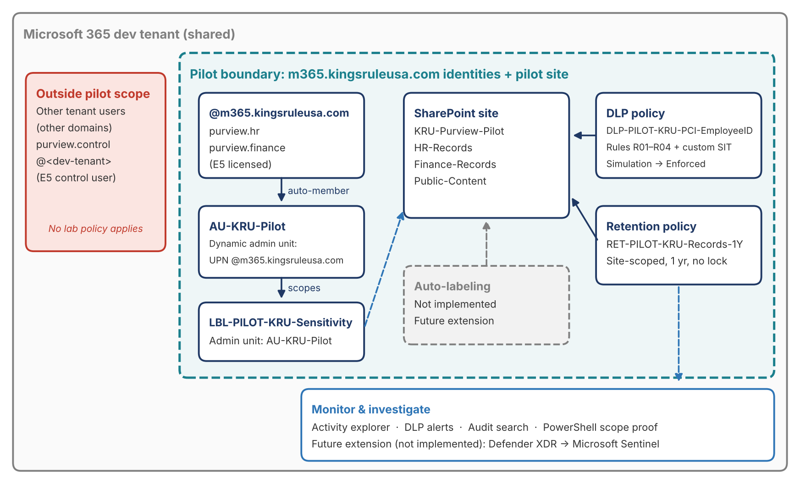](architecture.png)

```
Pilot boundary
    WHO   : AU-KRU-Pilot (dynamic, pilot domain only)  -> sensitivity labels
    WHERE : KRU-Purview-Pilot site only                -> DLP and retention
    NOT   : other users, mailboxes, OneDrive, Teams, devices

Content flow
    User saves file -> label applied (default / manual)
                    -> DLP evaluates content + label
                    -> R04 / R02 / R03 / R01 (most restrictive first)
                    -> policy tip, block, override, alert
                    -> Activity explorer + unified audit log
                    -> retention preserves deleted content
```

I used two scoping methods on purpose:

- **Labels are scoped by who.** The label policy targets a dynamic administrative unit built from the pilot domain. Any new user on the KRU domain joins the pilot automatically, and nobody else can.
- **DLP and retention are scoped by where.** Both policies target exactly one SharePoint site, with every other location turned off. Because the protection belongs to the data location, a pilot user's own OneDrive stays out of scope.

---

# Implementation

## 1. Readiness and Tenant Baseline

Before building anything, I ran a read-only readiness script to check my admin roles, the pilot domain, E5 licence availability, unified audit and any existing policies that could interfere. Because this was a shared tenant, I raised change **CHG-PV-000** and removed leftover labels and policies only after the tenant owner approved it.

```
Script:
Invoke-PurviewReadiness.ps1 (read-only)

Change:
CHG-PV-000, approved by tenant owner
```

---

## 2. Pilot Identities and Dynamic Administrative Unit

I created the pilot users, the control user and the dynamic administrative unit with PowerShell. Passwords were generated in memory, shown once and cleared, and never written to disk. The administrative unit contains only users on the KRU domain.

[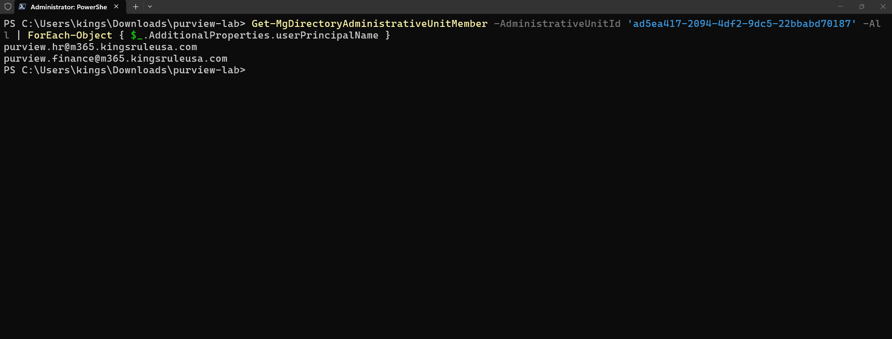](screenshots/01-au-kru-pilot-dynamic-members.png)

```
Script:
New-KruPilotIdentities.ps1

Membership rule:
(user.userPrincipalName -match "@m365\.kingsruleusa\.com$")

Result:
2 members, 0 outsiders
```

---

## 3. Pilot SharePoint Site and Least-Privilege Membership

I created the `KRU-Purview-Pilot` communication site with three libraries and gave both pilot users **Edit** as site members. There are no visitors and no duplicate permissions.

[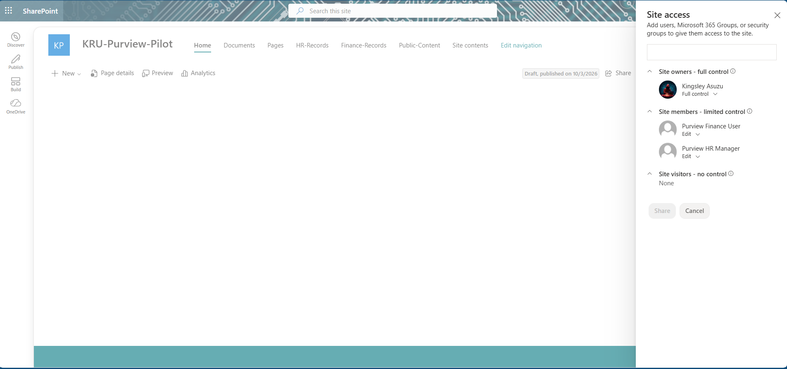](screenshots/02-site-membership-least-privilege.png)

---

## 4. Sensitivity Label Taxonomy and AU-Scoped Label Policy

I created four labels with PowerShell in ascending sensitivity, each with its own content markings. I then published them in a label policy scoped to `AU-KRU-Pilot`, with mandatory labelling, **KRU Internal** as the default, and justification required to lower a label.

| Label | Markings |
|-------|----------|
| KRU Public | None |
| KRU Internal | Footer: *KRU Internal Use Only* |
| KRU Confidential | Header: *KRU Confidential*, Footer: *Do Not Share Externally* |
| KRU Highly Confidential | Header, footer *Restricted*, watermark *HIGHLY CONFIDENTIAL* |

[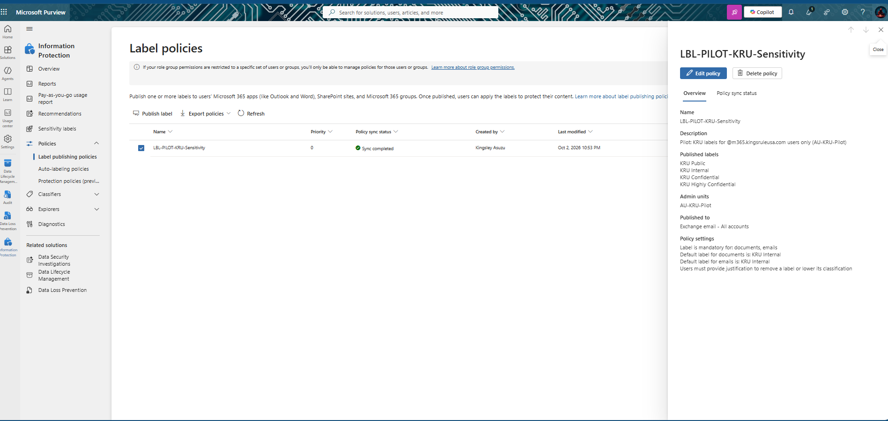](screenshots/03-label-policy-scoped-to-au.png)

---

## 5. Retention Policy Scoped to One Site

I created a static retention policy for the pilot site only: retain for one year, then do nothing. The wizard defaulted to *All sites, 7 years, Delete automatically*, and I changed all three before saving. I did **not** enable Preservation Lock, so the policy can be removed at teardown.

[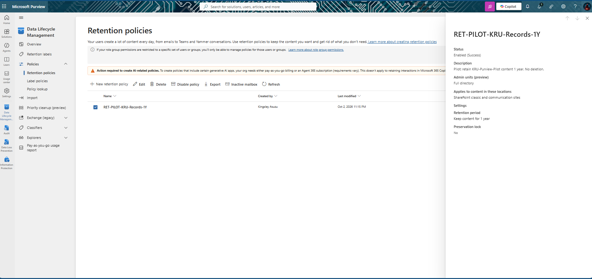](screenshots/04-retention-policy-one-site.png)

---

## 6. Label Validation: Pilot User versus Control User

I validated the scope boundary with a positive and a negative test. The pilot user sees the four KRU labels. The control user, who sits outside the administrative unit, sees no sensitivity labels at all.

[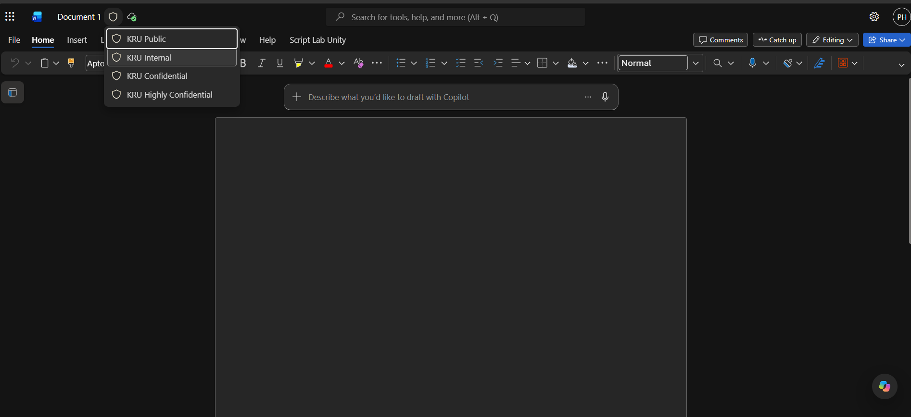](screenshots/05-tc01-pilot-user-sees-kru-labels.png)

[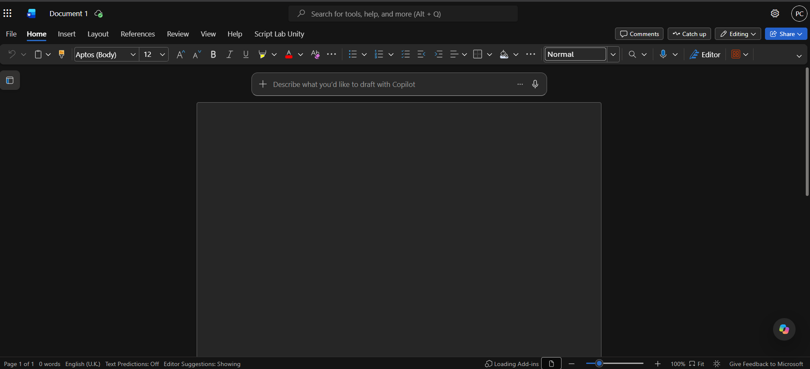](screenshots/06-tc02-control-user-no-labels.png)

I also confirmed that **KRU Confidential** applies its header marking, and that lowering a label prompts for a justification.

[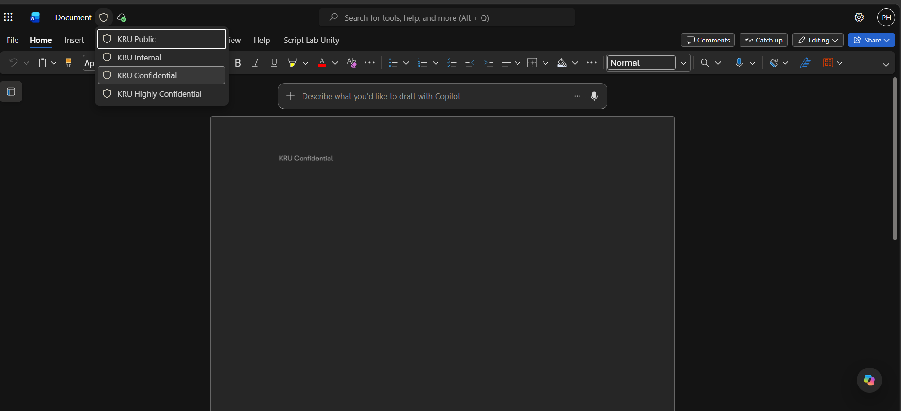](screenshots/07-tc04-confidential-header.png)

[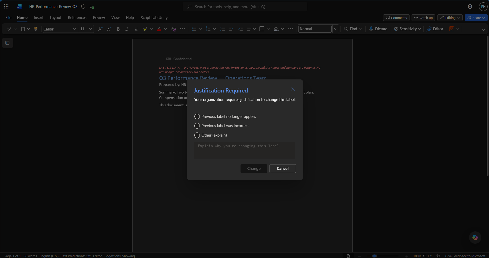](screenshots/08-tc05-downgrade-justification.png)

---

## 7. Custom Sensitive Information Type

I built `SIT-KRU-EmployeeID` from an XML rule package and tested it with `Test-DataClassification` against positive and near-miss samples before using it in any policy.

```
Primary element:
\bEMP-\d{6}\b

Supporting keywords (within 300 characters):
employee id, employee number, staff id, personnel number

Confidence:
85 (High)   = ID + keyword
65 (Medium) = ID only
```

[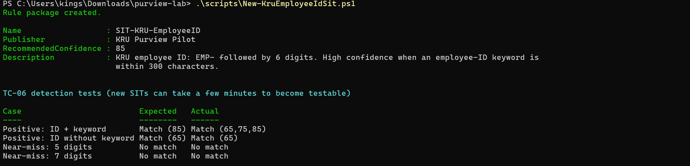](screenshots/09-tc06-custom-sit-tests.png)

---

## 8. Tiered DLP Policy in Simulation

I created the DLP policy with PowerShell in **simulation with policy tips**, scoped to the pilot site only. The rules are evaluated from the most restrictive to the least restrictive.

| Priority | Rule | Condition | Action | Severity |
|----------|------|-----------|--------|----------|
| 0 | R04-HighlyConfidential-External | Label = KRU Highly Confidential | Block external access, no override | High |
| 1 | R02-PCI-HighVolume | Credit Card Number ×5+, high confidence | Block external access, no override | High |
| 2 | R03-EmployeeID | SIT-KRU-EmployeeID ×1+, high confidence | Block external, **override with justification** | Medium |
| 3 | R01-PCI-LowVolume | Credit Card Number ×1–4, high confidence | Policy tip and audit only | Low |

R04 is triggered by the **label**, not the content. The board memo deliberately contains no sensitive information.

[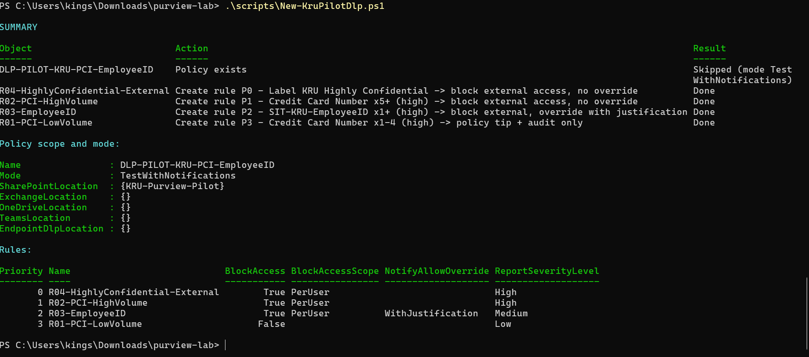](screenshots/10-dlp-policy-created-simulation.png)

---

## 9. Simulation Results

I uploaded the six test documents as the pilot users. Policy tips appeared on exactly the files I expected, and the clean files were not flagged.

[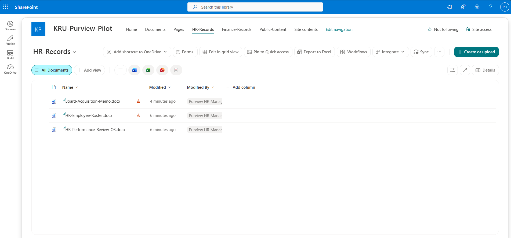](screenshots/11a-policy-tips-hr-records.png)

[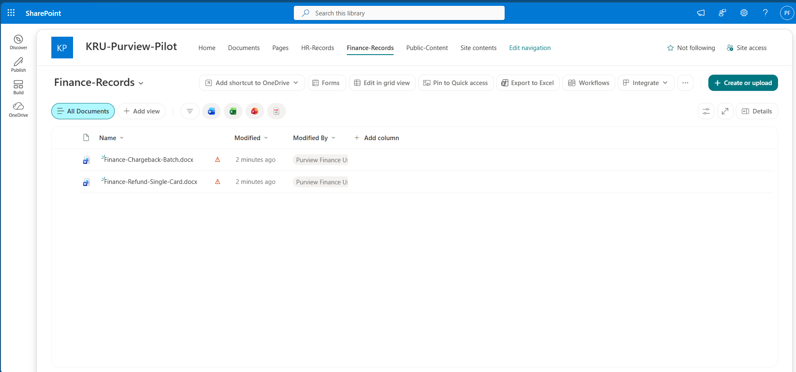](screenshots/11b-policy-tips-finance-records.png)

To prove the location scope, I uploaded the same six-card chargeback file to the finance user's **OneDrive**. It produced no match, because OneDrive is not in the policy.

[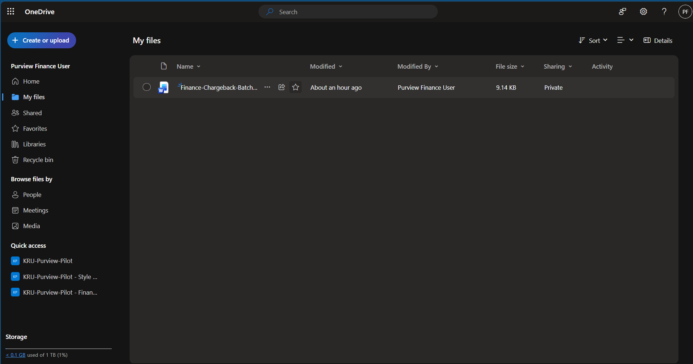](screenshots/11c-tc12-onedrive-out-of-scope-no-tip.png)

Activity explorer confirmed one match per rule on the correct files.

[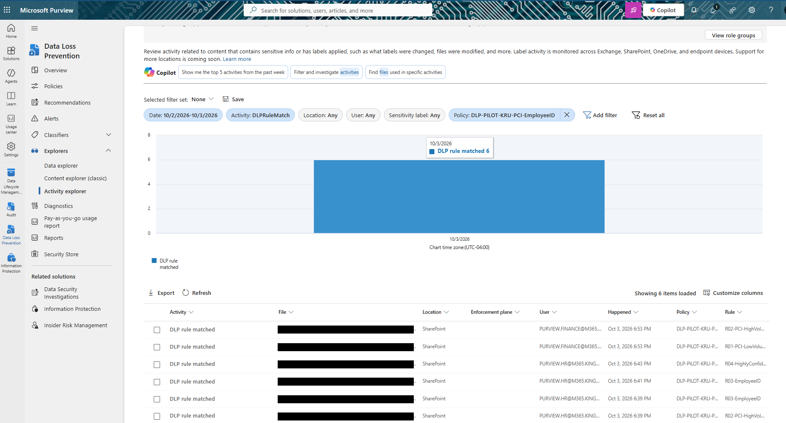](screenshots/12-dlp-simulation-matches-by-rule.png)

---

## 10. Retention Validation

I deleted a test file from the pilot site. The original was preserved in the site's **Preservation Hold Library**.

[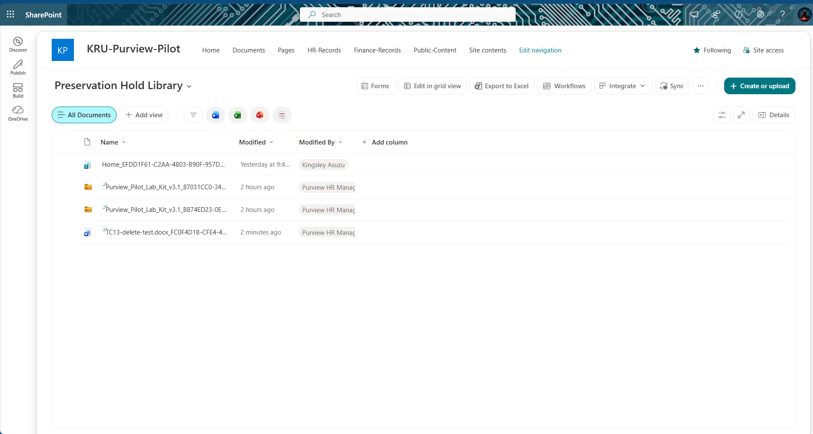](screenshots/13-tc13-preservation-hold-library.png)

---

## 11. Audit Trail for the Label Downgrade

I traced the downgrade from KRU Confidential to KRU Public in Activity explorer and in the unified audit log. Both records include the justification text the user entered.

[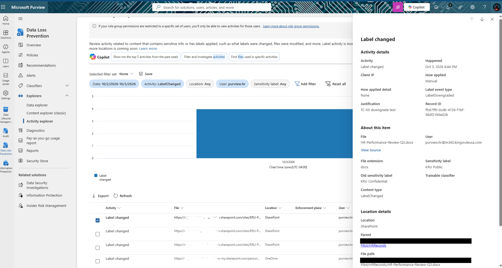](screenshots/14a-tc14-activity-explorer-downgrade.png)

[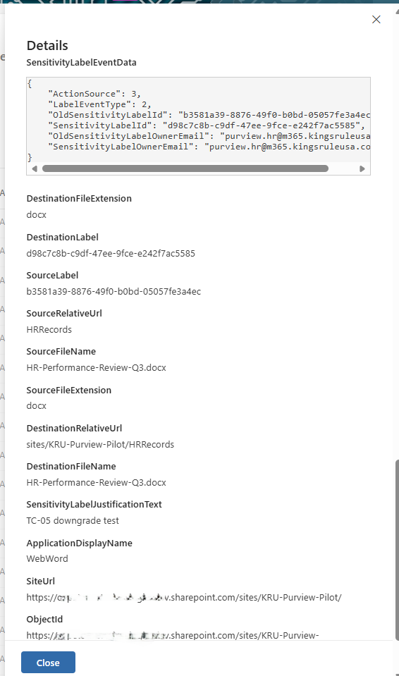](screenshots/14b-tc14-unified-audit-justification.png)

---

## 12. Enforcement (CHG-PV-002)

After reviewing the simulation results and a passing scope proof, I moved the policy to enforcement as a separate, recorded change.

```
Change:
CHG-PV-002

Command:
Set-DlpCompliancePolicy -Identity DLP-PILOT-KRU-PCI-EmployeeID -Mode Enable

Rollback:
Set-DlpCompliancePolicy -Identity DLP-PILOT-KRU-PCI-EmployeeID -Mode TestWithNotifications
```

---

## 13. External Sharing Tests

I shared each test file with an external Gmail account and opened it as that guest.

**Low volume (R01): allowed.** The guest can open the single-card refund, because R01 only warns.

[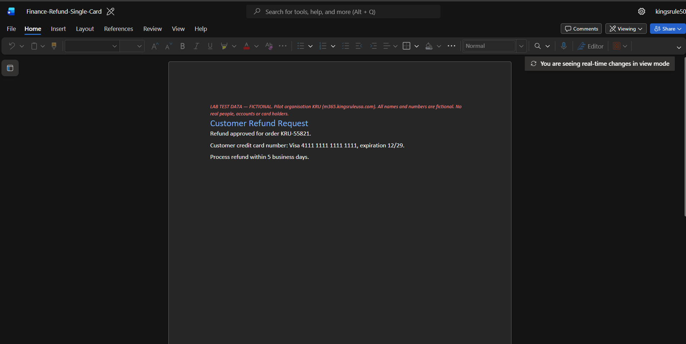](screenshots/15-tc07-guest-can-open-single-card.png)

**High volume (R02): blocked.** The same guest is blocked from the six-card chargeback batch. Activity explorer confirms the enforced match and its actions.

[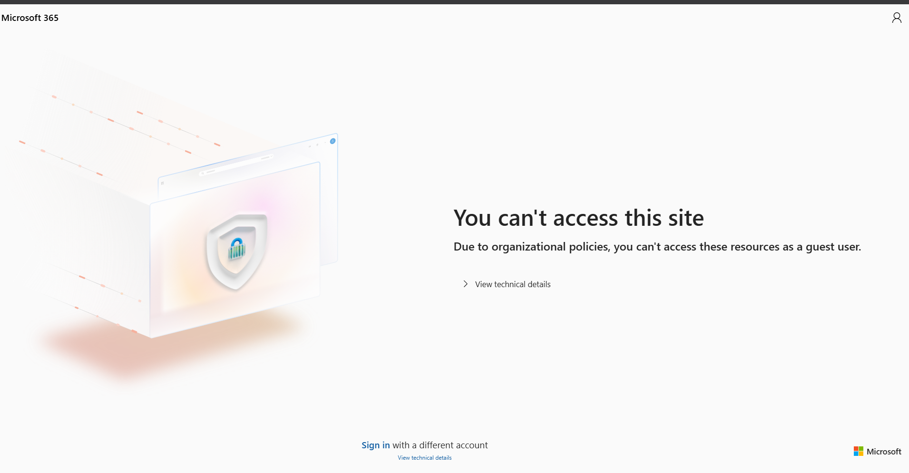](screenshots/16a-tc08-guest-blocked.png)

[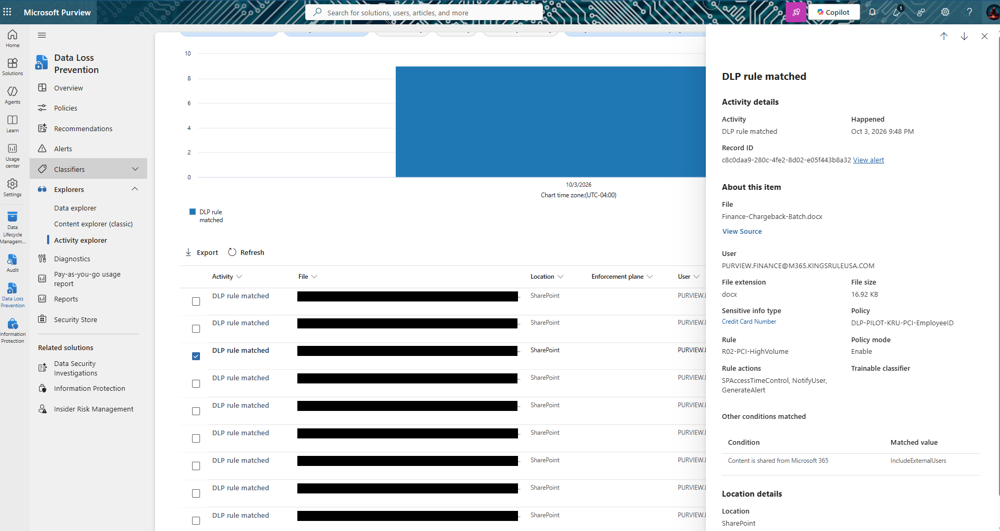](screenshots/16b-tc08-dlp-enforced-match.png)

**Employee IDs (R03): blocked, override with justification.** The share dialog blocks the roster. The user overrides with a business justification, after which the share succeeds and the guest can open it.

[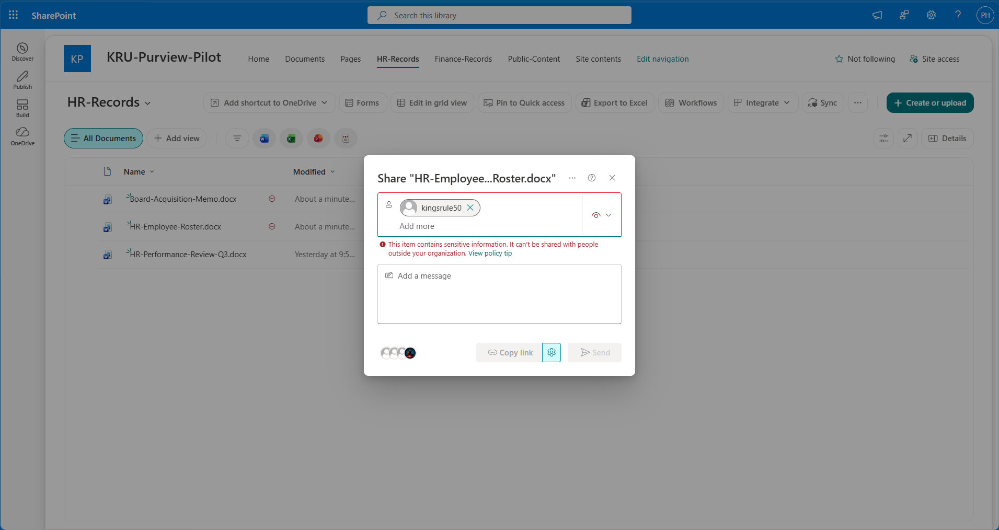](screenshots/18-tc09-share-blocked-in-dialog.png)

[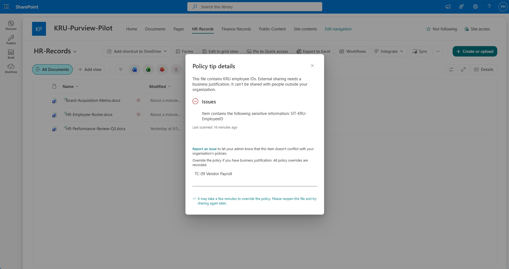](screenshots/19-tc09-override-submitted.png)

**Highly Confidential (R04): blocked, no override.** The board memo is blocked by its label alone, with no override option.

[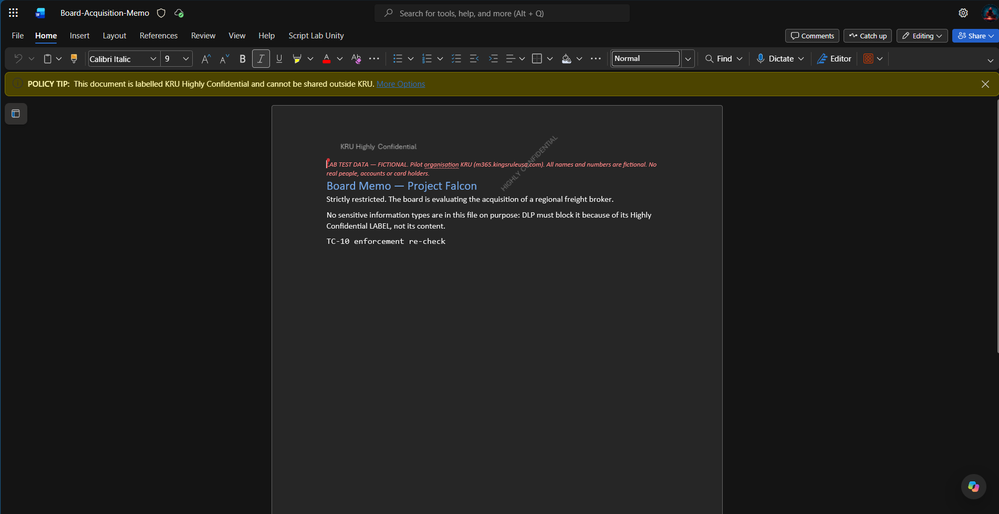](screenshots/20-tc10-r04-policy-tip-in-word.png)

[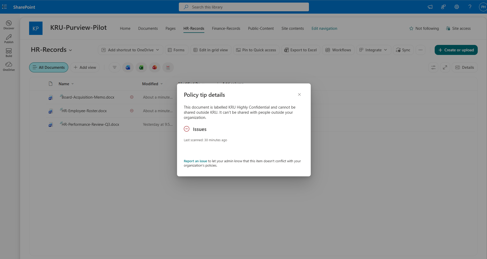](screenshots/21-tc10-no-override-label-driven.png)

**Near-miss press release: allowed.** The press release contains `EMP-12345` (five digits). It produced no match and opened normally for the guest.

---

## 14. DLP Alert Triage

The R02 match raised a high-severity DLP alert. I assigned it, classified it as a **Benign positive** (the detection was correct, but the activity was an approved test) and resolved it with the change reference.

[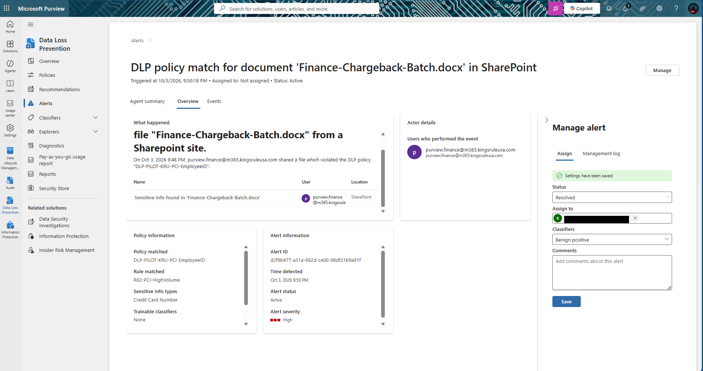](screenshots/17-dlp-alert-triage-benign-positive.png)

---

## 15. Scope Proof

I finished with a read-only PowerShell script that checks every pilot object against the boundary and exports a CSV and transcript to `evidence/`. All 17 checks passed.

[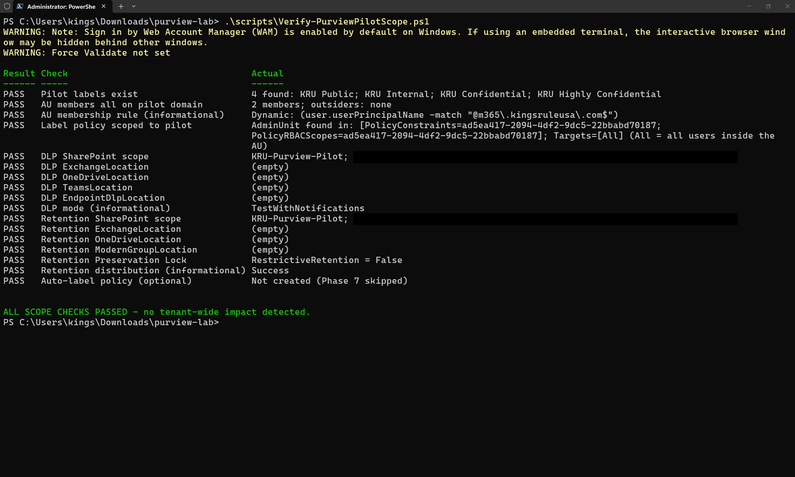](screenshots/22-tc15-scope-proof-all-pass.png)

```
Checks:
Labels, AU membership, label policy AU scope,
DLP locations, retention locations, Preservation Lock

Result:
17 / 17 PASS - no tenant-wide impact detected
```

---

# Validation Results

| Control / Test | Expected Result | Result |
|----------------|-----------------|--------|
| TC-01 Pilot user labels | Four KRU labels visible | PASS |
| TC-02 Control user labels | No KRU labels visible | PASS |
| TC-03 Default and mandatory labelling | KRU Internal applied by default | PASS |
| TC-04 Content markings | KRU Confidential header applied | PASS |
| TC-05 Downgrade justification | Justification required to lower a label | PASS |
| TC-06 Custom SIT accuracy | 85 / 65 / no match / no match | PASS |
| TC-07 R01 low-volume card data | Policy tip only; guest can open | PASS |
| TC-08 R02 high-volume card data | Guest blocked; alert raised | PASS |
| TC-09 R03 employee IDs | Blocked; override with justification allowed | PASS |
| TC-10 R04 Highly Confidential | Blocked by label; no override | PASS |
| TC-11 Near-miss false-positive check | No match; guest can open | PASS |
| TC-12 OneDrive out of scope | Same file, no match | PASS |
| TC-13 Retention | Deleted file preserved | PASS |
| TC-14 Audit trail | Downgrade and justification traceable | PASS |
| TC-15 Scope proof | 17 / 17 checks pass | PASS |

**Simulation:** 4 of 4 expected rule matches, 0 false positives, 0 out-of-scope matches.
**Overall:** 15 of 15 test cases passed.

---

# PowerShell Automation

Every script is idempotent, supports `-WhatIf`, uses interactive sign-in only and stores no credentials. Tenant-specific values are **required parameters**, never defaults, so a script cannot run against the wrong tenant by accident.

| Script | Purpose |
|--------|---------|
| [`Enable-LabModules.ps1`](scripts/Enable-LabModules.ps1) | Loads modules from `C:\PSModules` and removes OneDrive-synced module paths |
| [`Invoke-PurviewReadiness.ps1`](scripts/Invoke-PurviewReadiness.ps1) | Read-only readiness checks |
| [`New-KruPilotIdentities.ps1`](scripts/New-KruPilotIdentities.ps1) | Pilot and control users, licences and the dynamic AU |
| [`New-KruPilotLabels.ps1`](scripts/New-KruPilotLabels.ps1) | Four labels with markings, in priority order |
| [`New-KruEmployeeIdSit.ps1`](scripts/New-KruEmployeeIdSit.ps1) | XML rule package and detection tests |
| [`New-KruPilotDlp.ps1`](scripts/New-KruPilotDlp.ps1) | Tiered DLP policy and rules in simulation |
| [`Verify-PurviewPilotScope.ps1`](scripts/Verify-PurviewPilotScope.ps1) | Read-only scope proof with CSV and transcript export |

```powershell
.\scripts\Enable-LabModules.ps1
$admin = 'admin@<dev-tenant>'
.\scripts\Invoke-PurviewReadiness.ps1  -AdminUPN $admin
.\scripts\New-KruPilotIdentities.ps1   -ControlDomain '<dev-tenant>' -WhatIf
.\scripts\New-KruPilotLabels.ps1       -AdminUPN $admin
.\scripts\New-KruEmployeeIdSit.ps1     -AdminUPN $admin
.\scripts\New-KruPilotDlp.ps1          -AdminUPN $admin -SiteUrl 'https://<dev-tenant>.sharepoint.com/sites/KRU-Purview-Pilot' -AlertRecipient 'secops@<dev-tenant>'
.\scripts\Verify-PurviewPilotScope.ps1 -AdminUPN $admin
```

---

# Security and Operational Principles Demonstrated

**Blast-radius control:** every policy was scoped to a defined pilot, and I proved the scope with negative tests and a verification script instead of assuming it.

**Risk-based protection:** low-risk content gets a warning, medium-risk content allows a justified override, and high-risk content is blocked outright.

**Controlled deployment:**

```
Readiness → Configure → Simulate → Review → Enforce → Test → Investigate → Prove
```

**Separation of duties:** even a Global Administrator cannot view the content of a matched file without the separately assigned Data Classification Content Viewer role.

**Change management:** the baseline cleanup and the move to enforcement were each separate, approved changes with a documented rollback.

**Zero credentials in code:** interactive sign-in only, with no passwords or secrets stored in any script.

---

# Troubleshooting Lessons

### Override Is Not Approval

A justification override is not reviewed by anyone before it takes effect, so an insider could type a plausible reason. I accepted this deliberately for medium-risk data only: high-risk data cannot be overridden, every override is logged and alerted on, and in production I would feed overrides into **Insider Risk Management** so that **Adaptive Protection** removes the override option for users at elevated risk.

### Enforcement Is Not Immediately Retroactive

After the policy reached `Enable` with `Success`, the external guest could still open a file that had been scanned under simulation. Once a small edit forced DLP to re-evaluate the file, the guest was blocked. Existing content needs re-evaluation, or time, at go-live.

### DLP Inspects Inside Archives

A `.zip` of the lab kit was uploaded to the pilot site by mistake. DLP opened it and matched R02 and R03 on the documents inside before I deleted it. Zipping a file does not get it past DLP, and deleting it quickly does not remove the audit record.

### Retention Outlives the Recycle Bin

The same zip was deleted and removed from the Recycle Bin, but copies remained in the Preservation Hold Library. Content under retention can only be removed by taking the site out of the retention policy.

### Where Purview Stores Admin-Unit Scope

`Get-LabelPolicy` stores the administrative unit's object ID in `PolicyRBACScopes`, not in a property called "AdminUnits". I rewrote the scope-proof script to search every property for the AU object ID.

### A Cmdlet Can Report Success When a Rule Failed

`New-DlpComplianceRule` rejected a non-SMTP alert recipient, but the summary still reported "Done". I added `-ErrorAction Stop` per rule and a FAILED status to the output.

### Audit Records Carry the Administrative Unit

Label-change events are tagged with `AU-KRU-Pilot`, so a delegated administrator scoped to the AU could investigate KRU activity only.

### Audit Search Needs the Full ObjectId

A partial file name in the ObjectId field returned 0 results. Searching by user and date returned 178. Activity explorer was the faster place to investigate.

### Portal Defaults Are Risky in a Shared Tenant

The retention wizard defaulted to all sites, seven years and automatic deletion. In a shared tenant, every default must be checked before saving.

---

# Skills Demonstrated

- Microsoft Purview Information Protection
- Sensitivity label taxonomy and content markings
- AU-scoped label publishing policies
- Custom sensitive information types (XML, confidence levels, proximity)
- Tiered DLP rule design
- DLP simulation and enforcement
- DLP policy tips, overrides and user notifications
- DLP alert triage and classification
- Retention policies and the Preservation Hold Library
- Activity explorer and unified audit log investigation
- Microsoft Entra dynamic administrative units
- SharePoint Online permissions and external sharing
- PowerShell automation (Security & Compliance PowerShell, Microsoft Graph)
- Idempotent scripting with `-WhatIf`
- Read-only verification and evidence export
- Negative testing and false-positive testing
- Blast-radius control in a shared tenant
- Change management and rollback planning

---

# Project Outcome

I delivered a complete data protection pilot, from readiness through enforcement, investigation and scope proof, without affecting anyone else in a shared tenant. All 15 test cases passed. Every control is backed by a screenshot or script output, and the PowerShell can rebuild and re-verify the pilot.

This project is directly relevant to Microsoft 365 security, data protection and compliance engineering roles, where Purview controls must protect sensitive data without disrupting the business.

---

## Repository Structure

```
m365-purview-data-protection-lab/
|
|-- README.md
|-- .gitignore
|-- architecture.png
|
|-- scripts/
|   |-- Enable-LabModules.ps1
|   |-- Invoke-PurviewReadiness.ps1
|   |-- New-KruPilotIdentities.ps1
|   |-- New-KruPilotLabels.ps1
|   |-- New-KruEmployeeIdSit.ps1
|   |-- New-KruPilotDlp.ps1
|   \-- Verify-PurviewPilotScope.ps1
|
|-- evidence/
|   |-- dlp-rules-20261003-2027.csv
|   |-- labels-20261003-2027.csv
|   |-- scope-proof-20261003-2027.csv
|   \-- scope-proof-20261003-2027.txt
|
|-- test-data/
|   \-- 6 fictional test documents (.docx)
|
\-- screenshots/
    |-- 01-au-kru-pilot-dynamic-members.png
    |-- ...
    \-- 22-tc15-scope-proof-all-pass.png
```

---

## Portfolio Note

I completed this project in a shared Microsoft 365 development tenant, with the tenant owner's approval, using test identities and fictional data only. Tenant names, administrator accounts and IP addresses have been redacted from the screenshots and evidence files.

---

**Chinedu K. Asuzu**
Cloud Security Engineer | Microsoft 365 Security | Microsoft Purview | Microsoft Entra ID | Azure
